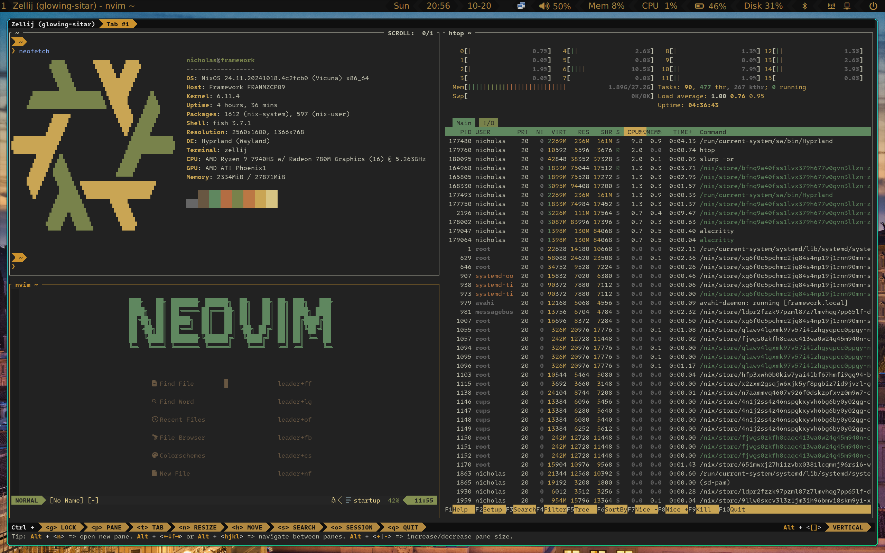

# NicksOS

The .nix configuration files for my Framework 16 laptop

## Inspiration

I want to give a big thanks @r6t for the example he provided with
[his NixOS configuration](https://github.com/r6t/nixos-r6t) which this
configuration is largely inspired by. Nix can be really, _really_ confusing, and
it always helps to have a guide!

## Screenshots

> Figure 1. The desktop

> Figure 2. The terminal
